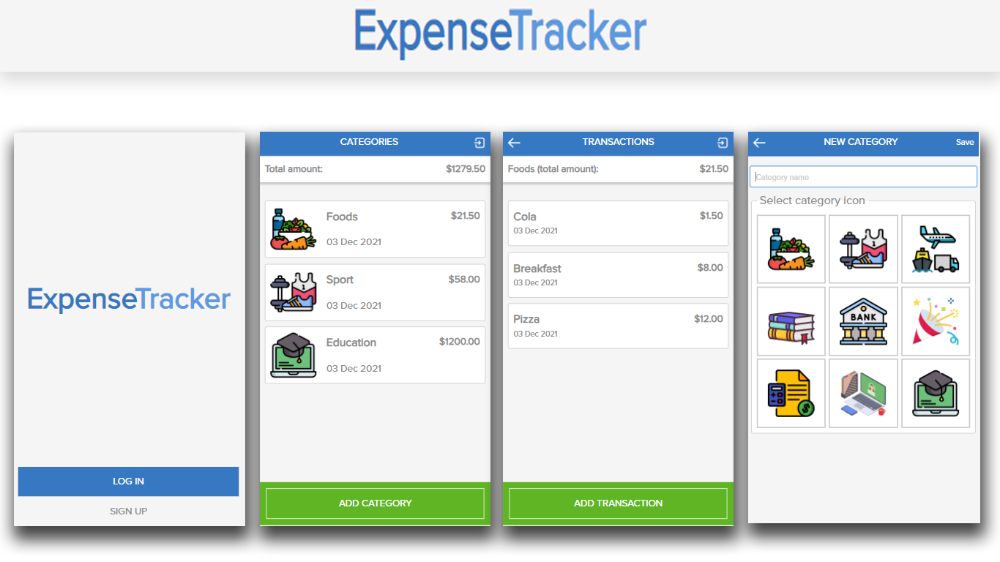

# ExpenseTracker
> This is a mobile web application where you can manage your budget: you have a list of transactions associated with a category, so that you can see how much money you spent and on what.

## Screenshot

# Built With

- Ruby
- Rspec
- Rails
- PostgreSQL

## Getting Started

To get a local copy up and running follow these simple example steps.

### Prerequisites

- [Ruby](https://www.ruby-lang.org/)
- [Ruby on Rails](https://rubyonrails.org/)

### Setup
- Clone or download this repo on your machine
- Enter project directory
- Run `install bundle` to install dependencies
- Run  `rake db:create` to create a database
- Run  `rake db:migrate` to create a migrations

### Run

Run `rails s` to run the server and open `localhost:3000` in browser

### Test

Run `bundle exec rspec` to run tests
## Author

👤 **Tolib**

- GitHub: [@toliboff](https://github.com/toliboff)
- Twitter: [@tolib_tolibov](https://twitter.com/tolib_tolibov)
- LinkedIn: [Tolibjon Tolibov](https://linkedin.com/in/tolibjon-tolibov)

## 🤝 Contributing

Contributions, issues, and feature requests are welcome!

Feel free to check the [issues page](https://github.com/toliboff/expence-tracker/issues).

## Show your support

Give a ⭐️ if you like this project!

## Acknowledgments
- [Microverse](https://www.microverse.org/) 
- Original design idea by [Gregoire Vella](https://www.behance.net/gregoirevella)
- [Original design on Behance](https://www.behance.net/gallery/19759151/Snapscan-iOs-design-and-branding?tracking_source=)
- [Proxima Nova Font](https://www.freefontsfamily.com)
- [Flaticon free icons](www.flaticon.com)
